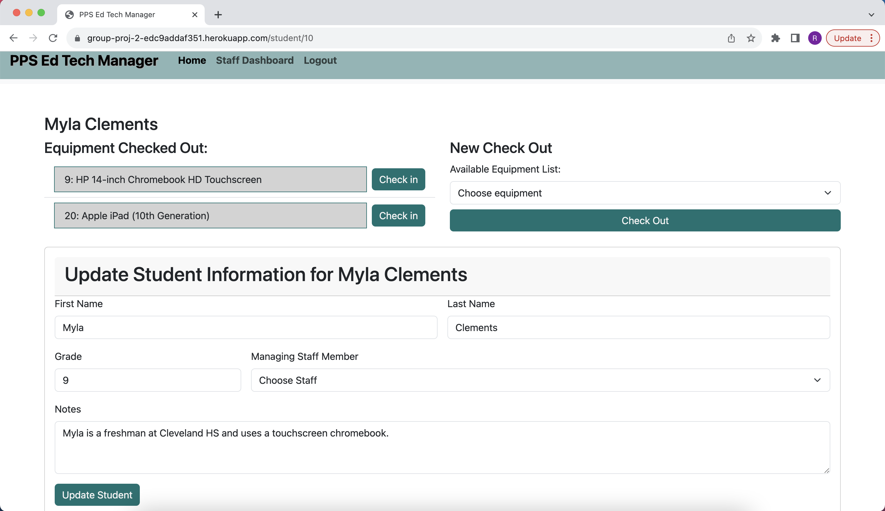
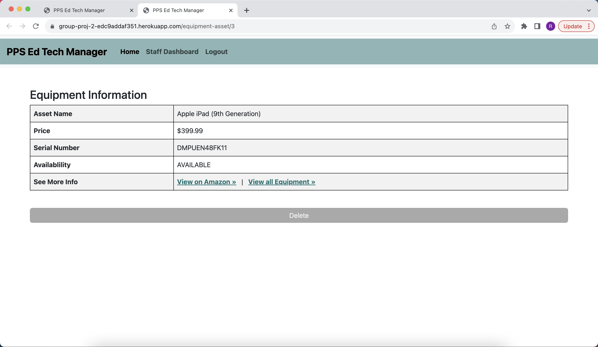
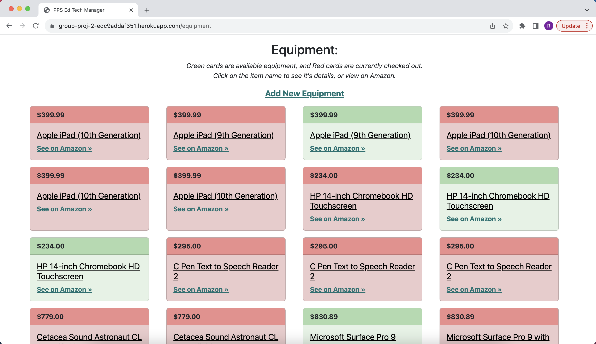

# Education Technology Manager

EdX Coding Bootcamp - Project 2 - Group 4

## Table of Contents

- [Description](#description)
- [Installation](#installation)
- [Usage](#usage)
- [Screenshot](#screenshot)
- [License](#license)
- [Contributors](#contributors)
- [Test](#test)
- [Questions](#questions)

## Description

Education Technology Manager

App that manages a library of technology and equipment that is checked out by staff for students across different schools.

Users can:

- View all available equipment
- Check out available equipment to a student
- Check in equipment from a student
- Add/update/delete a student
- Update their own staff record
- Add/delete equipment
- Add/update/delete a school (future development)
- Add/update a ticket (future development)

## Installation

- [NodeJS v16.18.0](https://nodejs.org/dist/v16.18.0/node-v16.18.0-x64.msi) recommended
- [MySQL](https://dev.mysql.com/)
- [Express.js](https://expressjs.com/en/4x/api.html)
- [Sequelize](https://sequelize.org/)
- [Dotenv](https://www.npmjs.com/package/dotenv)
- [Handlebars](https://handlebarsjs.com/)

While in the root directory of the application, enter "npm install" into the terminal.

## Usage

- In the top navagation bar, click 'Sign Up' and create your profile.  
  
- Once logged in, you can view your 'Staff Dashboard' where you can see the students you manage, add students (and update and delete), view all equipment checked out to those students, and view your basic profile information.  
  
- Click on a student's name to view their profile. Here, you can check in equipment that they are done using, check out new, available equipment, and update their profile, or delete it altogether.  
  
- From your dashboard, click on a piece of equipment to see its details, and / or delete it from the database.  
  
- From here, or from your dash, you can click on 'view all equipment' and you'll see a page full of color-coded (checked out or available) cards containing the equipment name, link to it's details page, price, and link to its Amazon page. You can also 'add equipment' using the form at the bottom of the page.  
  
- Back at your dashboard, you can view your full profile by clicking on the link at the bottom of your profile card. Here, you can update your information!  
  
- Once you've created an account, you can login at anytime! You will be automatically signed out after 24 hours.

## Screenshots

## License

MIT License
See [LICENSE](/LICENSE) file in contatining directory

## Contributors

Randi Brown
Quinn Sargent
Dusty Brigsby

Used the references and tutorials from:

- Multiple activities from 13-ORM class lessons and files.
- Multiple activities from 14-MVC class lessons and files.
- [The MySQL Documentation](https://dev.mysql.com/doc/)
- [MDN Web Docs](https://developer.mozilla.org/en-US/docs/Web/JavaScript)
- [W3 Schools](https://www.w3schools.com/mysql/default.asp)
- [Sequelize documentation](https://sequelize.org/docs/v6/)
- [Express documentation](https://expressjs.com/en/4x/api.html)
- [Handlebars documentation](https://handlebarsjs.com/)
- [Bootstrap documentation](https://getbootstrap.com/)

## Test

N/A

## Questions?

[Education Technology Manager](https://github.com/randirose/group-proj-2)

If not found there, you can email one of the developers:

[Randi Brown](mailto:randibrown21@gmail.com)
[Quinn Sargent](mailto:quinnwsargent@gmail.com)
[Dusty Brigsby](mailto:dustybrigsby@gmail.com)
